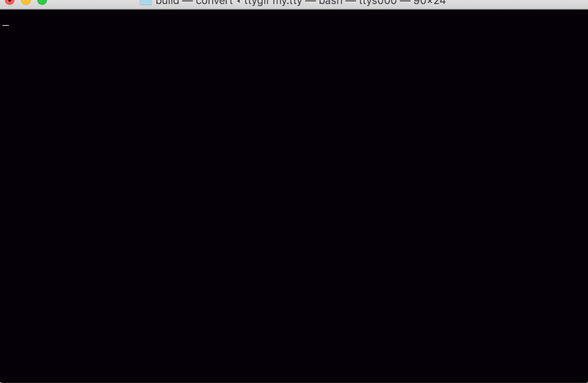

# Kademlia
>Academic implementation of the Kademlia protocol, for the Distributed Algorithms course



[](https://travis-ci.com/davidepi/kademlia)
[](https://github.com/davidepi/kademlia)

This is the project for the Distributed Algorithms course.

It provides an implementation in C++ of the Kademlia protocol. 

## Dependencies

The only dependency required to run the software is CMake 3.1 or higher, since it is used as a build system. Cmake can be downloaded [here](https://cmake.org "cmake homepage"), however, it should be available in `brew` and in almost every package manager.

## Building and running

Assuming cmake 3.1+ and build essentials are already installed, these are the instructions
required to compile the software

```
mkdir build/
cd build/
cmake ..
make
```

The gateway node should be started with `./kad -P <port> -x` and every other node with `./kad -i <gateway_ip> -p <gateway_port> -x`. 

Being a peer to peer system, every other client can be started by issuing the ip and port of a node already in the network, not necessarily the gateway one.

### Logging
In order to check the correct execution of the protocol, starting a node with the flag `-l3` generates a log file containing a description of every message sent or received by the node. 

On the other hand, since the message exchange is huge when there is an high number of nodes, logging can be disabled with the flag `-l0`. 

The default behaviour logs to stdout and not to file and could be really verbose also with a small number of nodes, hence the reason of the flag to suppress logging.

## Known limitations
Being an academic implementation, this version of Kademlia has some limitations. 

First of all keys are not republished every hour. This is a problem in a prodcution environment, however, providing long uptimes was out of scope for this project and thus key republication has not been implemented.

Another limitation is the high number of PING requests that are sent. This one was already highlighted in the original Kademlia paper, and a solution was proposed to mitigate it, however it is not implemented here

## License
The source code is licensed under the MIT license. A copy of the license is available in the [LICENSE](./LICENSE) file.
